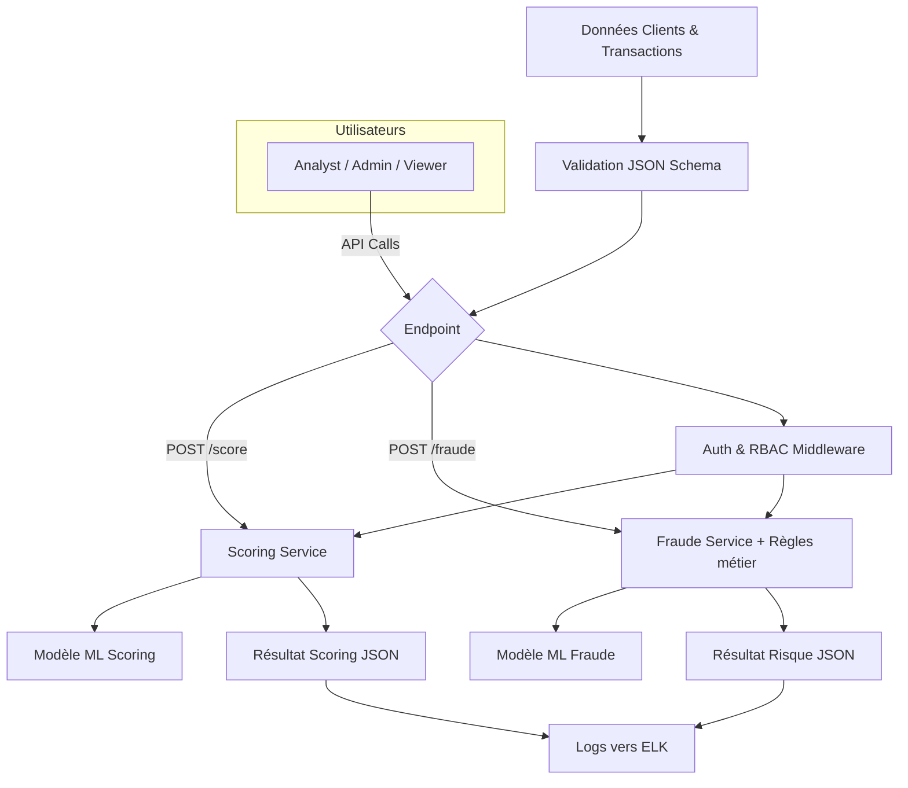

# 🌐 API-Integration => Scoring MLOps Platform
# API Scoring & Détection Fraude

## 🧩 Description
Ce projet implémente une API FastAPI pour exposer des endpoints de **scoring crédit** et **détection de fraude**.  
Il inclut :

- Validation JSON Schema avec Pydantic.
- Logique métier et modèles ML fictifs pour scoring et fraude.
- Logging structuré vers Elasticsearch/Logstash (ELK).
- Authentification OAuth2/OpenID Connect (Keycloak/Okta) avec RBAC.
- Tests unitaires et d’intégration avec Pytest.
- Collections Postman prêtes à l’import pour tests manuels et automatisés.

---
## ♻️ Flux global

---

## 🗂️ Structure du projet
```bash
api_integration/
│
├── app/
│   ├── __init__.py
│   ├── main.py                     # Point d’entrée principal FastAPI
│   ├── config.py                   # Variables d’environnement, connexions ES, Keycloak, etc.
│   │
│   ├── models/
│   │   ├── __init__.py
│   │   ├── scoring_model.py        # Chargement du modèle ML scoring (fictif ou réel, ONNX/PMML)
│   │   ├── fraude_model.py         # Modèle ML fraude + règles métier
│   │
│   ├── schemas/
│   │   ├── __init__.py
│   │   ├── score_schema.py         # Pydantic models pour validation du payload /score
│   │   ├── fraude_schema.py        # Pydantic models pour validation du payload /fraude
│   │
│   ├── routes/
│   │   ├── __init__.py
│   │   ├── score_routes.py         # Endpoint POST /score (validation + appel modèle)
│   │   ├── fraude_routes.py        # Endpoint POST /fraude (règles + modèle + log ELK)
│   │
│   ├── services/
│   │   ├── __init__.py
│   │   ├── scoring_service.py      # Logique métier scoring (prétraitement, appel modèle, post-traitement)
│   │   ├── fraude_service.py       # Logique détection fraude (règles + scoring)
│   │
│   ├── auth/
│   │   ├── __init__.py
│   │   ├── auth_handler.py         # Vérification JWT (Keycloak/Okta), récupération JWKS
│   │   ├── rbac.py                 # Gestion des rôles et dépendances require_roles()
│   │
│   ├── logging/
│   │   ├── __init__.py
│   │   ├── elk_logger.py           # Logging structuré vers Elasticsearch (via HTTPHandler/Logstash)
│   │   ├── log_config.json         # Config JSON de logging (niv., format, destinations)
│   │
│   ├── utils/
│   │   ├── __init__.py
│   │   ├── helpers.py              # Fonctions utilitaires génériques (hashing, formattage, etc.)
│   │   ├── validators.py           # Validation custom des champs avant passage au modèle
│   │
│   ├── security/
│   │   ├── __init__.py
│   │   ├── token_utils.py          # Fonctions pour générer/valider des JWT en test
│   │   ├── keycloak_client.py      # Intégration Keycloak/Okta (récupération des rôles, introspection)
│   │
│   └── tests/
│       ├── __init__.py
│       ├── test_score_endpoint.py  # Tests unitaires et intégration /score (JSON Schema + résultats)
│       ├── test_fraude_endpoint.py # Tests /fraude (règles + logging)
│       ├── test_auth_security.py   # Tests OAuth2, JWT expirés/mal signés, RBAC
│       ├── test_injection.py       # Tests payloads malveillants (SQL/JSON injections)
│       ├── test_logger.py          # Tests du logging ELK
│       └── conftest.py             # Fixtures pytest (client FastAPI, tokens mockés)
│
├── scripts/
│   ├── generate_fake_transactions.py # Génère automatiquement des dizaines de payloads aléatoires
│   ├── load_test_runner.py           # Exécute tests de charge (via HTTPX/Locust)
│
├── postman/
│   ├── API_Scoring_Fraude.postman_collection.json      # Collection simple (endpoints + exemples)
│   ├── API_Scoring_Fraude_Tests.postman_collection.json# Collection avec tests automatisés (vérif score/risque)
│   ├── environment_local.postman_environment.json      # Variables (host, port, token, index ELK)
│   ├── batch_profiles.json                             # 50+ profils clients/transactions aléatoires
│
├── .env.example              # Exemple de config locale (Elastic, Keycloak, DB)
├── requirements.txt          # Dépendances (FastAPI, httpx, python-jose, elasticsearch, pytest)
├── Dockerfile                # Image pour API (FastAPI + Uvicorn)
├── docker-compose.yml        # Services : API, Elasticsearch, Kibana, Keycloak (optionnel)
├── config.yaml               # Configuration applicative (seuils scoring, règles fraude)
├── README.md                 # Doc d’installation, exécution, configuration Keycloak
└── run.sh                    # Script pour lancer API + tests (facilitateur dev)

```


---

## ⚙️ Installation

1. Cloner le projet :
```bash
git clone <repo_url>
cd api_integration
```

2. Créer un environnement virtuel et installer les dépendances :

```bash
python -m venv venv
source venv/bin/activate  # Linux/Mac
venv\Scripts\activate     # Windows
pip install -r requirements.txt
```
3. Configurer les variables d’environnement ``(.env)`` :
```env
ELASTIC_URL=http://localhost:9200
KEYCLOAK_ISSUER=https://keycloak.example.com/realms/myrealm
KEYCLOAK_CLIENT_ID=my-client-id
KEYCLOAK_CLIENT_SECRET=secret
MODEL_PATH=models/scoring_model.onnx
```
4. Lancer l’API :
```bash
uvicorn app.main:app --reload --host 0.0.0.0 --port 8000
```
5. Accéder à la documentation Swagger :
```bash
http://localhost:8000/docs
```
## 📌 Endpoints principaux
| Endpoint | Méthode | Description | Rôle requis |
|---|---:|---|---|
| `/score` | `POST` | Calcul du score crédit | `analyst`, `admin` |
| `/fraude` | `POST` | Détection fraude | `analyst`, `admin` |
| `/admin/...` | `GET` / `POST` | Actions administratives (gestion modèles, logs, config) | `admin` |

---

## Exemples de payload
### Exemple payload `/score`
```json
{
  "age": 35,
  "revenu": 50000,
  "historique_impaye": 1
}
```

### Exemple payload `/fraude`
```json
{
  "transaction_id": "TX12345",
  "montant": 2000,
  "type": "virement",
  "client_id": "C1001"
}
```

---

## 🔒 Authentification & RBAC
- **Protocole** : OAuth2 / OpenID Connect (Keycloak ou Okta recommandés).
- **JWT** : Valider la signature, `iss`, `aud` et `exp`.
- **Rôles disponibles** : `admin`, `analyst`, `viewer`.
- **Sécurisation des endpoints** : utiliser un décorateur / dépendance `require_roles()` (ex. dépendance FastAPI) pour vérifier les rôles avant exécution.

---

## 📊 Logging & Monitoring
- **Format des logs** : JSON structuré.
- **Destination** : Elasticsearch (index `api-logs-*`).
- **Exemples de métriques** : `auth_failures_count`, `forbidden_count`, `request_latency_ms`.

---

## ✅ Tests
- **Framework** : `pytest`.
- **Cas à couvrir** : JWT expirés, RBAC, règles métier, injections, payloads invalides.

---

## 🌐 Postman
- **Collection** : `postman/API_Scoring_Fraude.postman_collection.json`
- **Tests automatisés** : `postman/API_Scoring_Fraude_Tests.postman_collection.json`
- **Environment** : `postman/environment_local.postman_environment.json`

---

## 🐳 Docker
- **API** : `Dockerfile`
- **Services** : `docker-compose.yml` (API + Elasticsearch + Kibana + Keycloak)

---

## 🔒 Sécurité & Conformité
- Masquer les secrets (Vault / variables d’environnement).
- Rotation des clés et tokens.
- Conformité GDPR : droit à l’effacement, minimisation des données.
 

